# How to set up a free Minecraft server & panel in Oracle Cloud

This guide covers setting up a free Minecraft server and then using Pterodactyl to create a panel for it. Everything will be hosted in the cloud for free by using Oracle Cloud. All the steps in this guide can be followed for free but be sure to check the [Prerequisites](#Prerequisites).

I will use the Curseforge modpack [Craft to Exile 2](https://www.curseforge.com/minecraft/modpacks/craft-to-exile-2) as an example in this guide, you can also follow along with any other type of server (such as Vanilla).

## Prerequisites

- **A valid credit card**: This cannot be a single-use credit card, we will be using this to sign up for Oracle Cloud and using pay-as-you-go to get the free VM as quickly as possible.
- **A domain:** This is necessary for the Pterodactyl panel. You can follow [this guide](https://www.youtube.com/watch?v=kds41s3tjEY) on how to get a free domain (or skip this if you do not care about the panel).

## Table of Contents
- [Creating a Minecraft server](creating-a-minecraft-server)
- [Pterodactyl Panel](pterodactyl-panel)

## Creating a Minecraft server

In this section we set up the Minecraft server using Oracle Cloud. If you prefer watching a video instead of reading, I'd suggest [this video](https://www.youtube.com/watch?v=0kFjEUDJexI) which covers everything in this section.

> [Note]
> Oracle Cloud does not always load properly on Google Chrome, so I suggest using a different browser like Microsoft Edge.

### Creating an account

- Start by [signing up for Oracle Cloud](https://signup.cloud.oracle.com/) if you have not yet done it.
- Set a Home Region as close as possible, I am from The Netherlands so I will select `Netherlands Northwest (Amsterdam)`
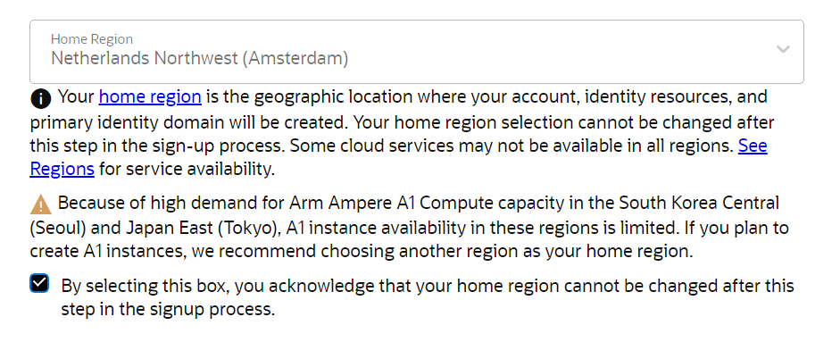
- Add your Payment / Identity Verification 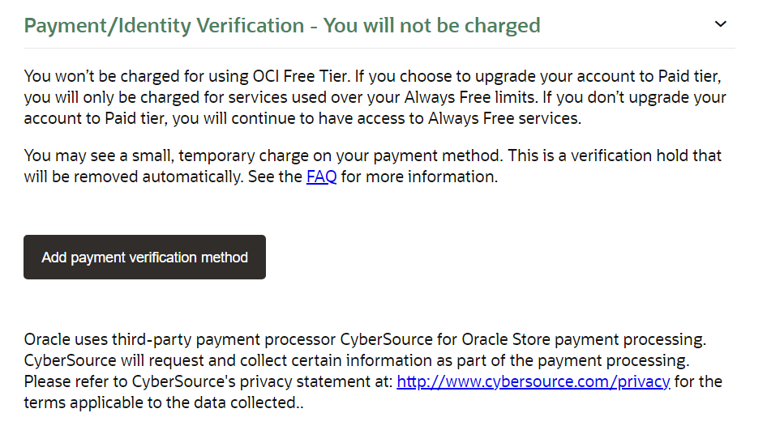
- As you can see this is where the Credit Card is necessary for 
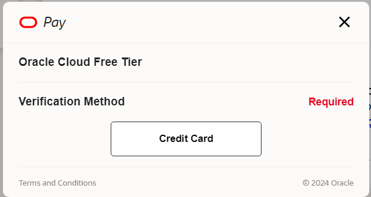
- $1 will be reserved from your credit card, but you will instantly get it back

### Setting up the VM instance

After signing up head to the Oracle Cloud [dashboard](https://cloud.oracle.com/) and scroll down to `Create a VM instance`.

- Here you want to fill in a name, for instance `Minecraft VM`.
- Leave everything to their default settings, except for the following.
  - **Image**: This should be set to `Ubuntu`, you want to use the latest Ubuntu version that is not Minimal. At the time of writing that is `Canonical Ubuntu 22.04`
  - **Shape**: You want to set the `Shape series` to `Ampere`, this will give you one option for `Shape name` which should be `VM.Standard.A1.Flex`. Then for the number of `OCPUs` set it to 4 and the `Amount of memory (GB)` should be set to 24.
- For the final step on this page you want to click on `Save private key`, this is necessary for later steps where we access the files of the server.
- Now you can press `Create` at the bottom left of the page.

If you get an error that the VM is not available, then change your settings to `Pay As You Go`. You can do this in the [Billing settings](https://cloud.oracle.com/invoices-and-orders/upgrade-and-payment), under the tab `Upgrade and Manage Payment`. Just like registering this change will reserve about 100 dollars on your credit card and instantly give it back after confirming the credit card.

#### Setting up the subnet

After creating the VM you will see the overview of the instance. On the tab `Instance information` you will see the **Subnet** under `Primary VNIC`, click on it.
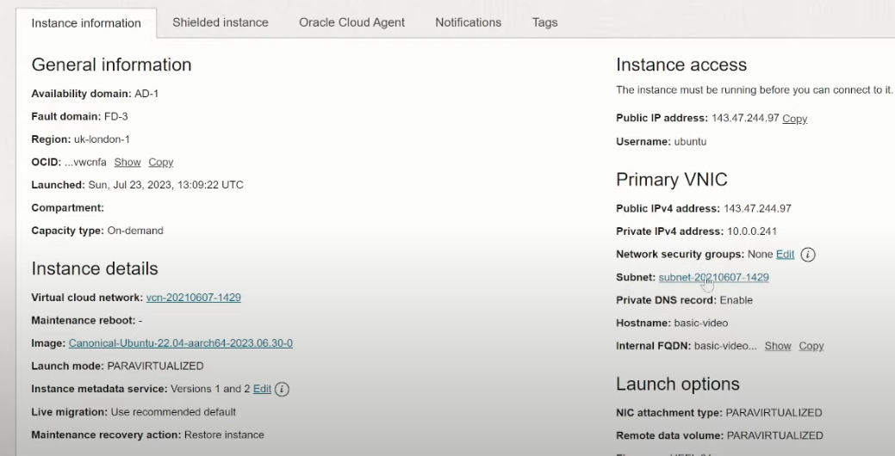\
This will bring you to the overview of the subnet information, here you want to click on the only option under `Security Lists`.
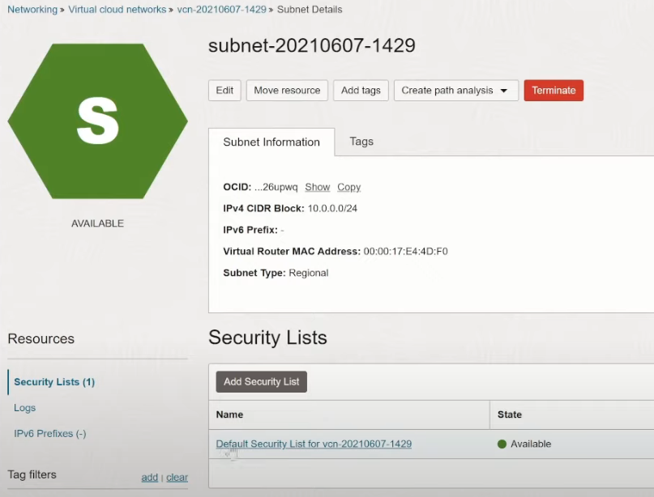\
Click on `Add Ingress Rules` and fill in the following:

- Source CIDR: `0.0.0.0/0`
- IP Protocol: `TCP`
  Click on `+ Another Ingress Rule` and fill in the following for that:
- Source CIDR: `0.0.0.0/0`
- IP Protocol: `UDP`
  This will port forward everything, if you want to be on the safe side you can fill in the `Destination Port Range` with the port you want to forward.

### SSH into server

This can be done using [PuTTY](https://www.putty.org/) or using the command line if you have SSH set up.
If you are unsure if you have SSH set up on your PC, then open a terminal and write `ssh`. If there is no error then you can use SSH and following the steps of [Command line](#command-line).

If you would like to use the command line method on Windows, then follow these [steps](https://learn.microsoft.com/en-us/windows/terminal/tutorials/ssh).

#### Command line

Start by locating the private key file that you saved previously. Copy the location of this file, for instance `C:\Users\Stephan\Downloads\oracle\private.key`. Next, find the IP address of your Oracle VM.
Use the following syntax to SSH into it:

```bash
ssh -i "{private key location}"ubuntu@{your VM ip address}
```

For example, I use the following command:

```bash
ssh -i "C:\Users\Stephan\Downloads\oracle\private.key"ubuntu@123.456.789.012
```

#### PuTTY

The second method of accessing the terminal of your VM is by using [PuTTY](https://www.putty.org/).

- Download and install PuTTY
- Search for `PuTTYgen` in your Windows applications and open it
- Click on `Load` and search for your private key and open it
  - Be sure to set the file search on `All Files (*.*)` otherwise you won't be able to find your key. 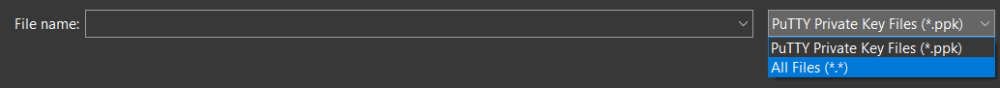
- After loading the key press on `Save private key`
  - You can save it without a passphrase
- Now open PuTTY
- Use `ubuntu@{your ip address}` for the host name
- Then open the Credentials menu, found under Auth 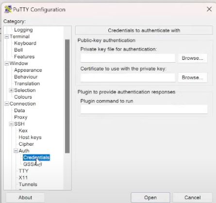
- Click on `Browse...` behind the text box for `Private key file for authentication`
- Search for the file you just generated with PuTTYgen and click `Open`
- Now you can click on `Open` and it will start the connection
- You will get a message from `PuTTY Security Alert`, press `Accept`
- Now you are in the terminal of your VM

### Updating the software

Now we need to update the software that the VM uses. Use the following commands.

- Start with getting elevated access:

```bash
sudo -s
```

- Get the available updates:

```bash
apt update
```

- Install the upgrades:

```bash
apt upgrade
```

After the upgrade you will see the following screen. You can press `Tab` to select `<Ok>` and then enter to exit it.
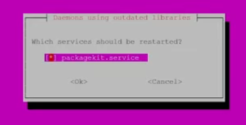
There might be multiple services that need to be restarted, just leave them on their default settings and select `<Ok>`.

### Firewall settings

```bash
apt install firewalld
firewall-cmd --permanent --zone=public --add-port=25565/tcp
firewall-cmd --permanent --zone=public --add-port=25565/udp
firewall-cmd --reload
```

If you get the following screen after installing firewalld then restart the VM.
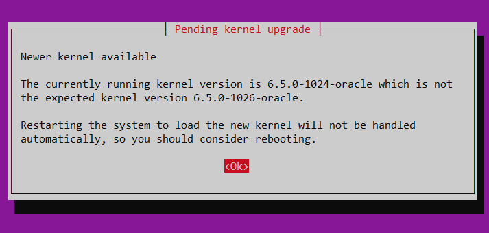
You can restart it by simply heading over to the overview of instances and clicking reboot.
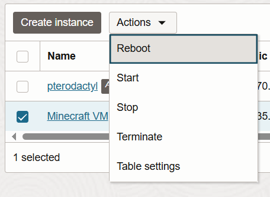

##### DBUS Error

If you get an error `Error: DBUS_ERROR: Failed to connect to socket /run/dbus/system_bus_socket: No such file or directory` then use the following commands.

- `sudo apt-get install dbus`
- `sudo systemctl start dbus`
- `sudo systemctl enable dbus`
- `sudo systemctl status dbus`
- `sudo systemctl restart firewalld`
- `sudo firewall-cmd --state`
  And try the same commands again.

### Screen

To list all attached and detached screen

```shell
screen -ls
```

To stop a screen session

```shell
screen -XS <session-id> quit
```

To run the server in a screen session (be sure to be in the same directory as the file)

```shell
screen ./run.sh
```

To exit a screen session: `CTRL A + D`
To reattach to a session

```
screen -r <session-id>
```

### Accessing the server files

- `sudo chown -R ubuntu:ubuntu .`
- winscp: [Connecting to the Compute Instance Using WSCP (oracle.com)](https://docs.oracle.com/en/cloud/saas/enterprise-performance-management-common/diepm/epm_agent_auto_compute_connect_wscp.html)

## Pterodactyl Panel

This section covers the process of how to set up the Pterodactyl panel, which is very useful for managing your server. If you prefer watching a video over reading, then I suggest watching this [video](https://www.youtube.com/watch?v=ZQ-00n2RTMU) which covers almost everything in this section.

### Creating the panel VM

- Head back to the Oracle Cloud [dashboard](https://cloud.oracle.com/) and scroll down to `Create a VM instance`.
- You can name this VM `panel` or any other name that reminds you that this is not the Minecraft server VM
- Select as image `Ubuntu 22.04`, just like previously
- Click on `Specialty and previous generation`
- Select `VM.Standard.E2.1.Micro` (or any other with `Always Free-eligible`)
- Click on `Select shape`
  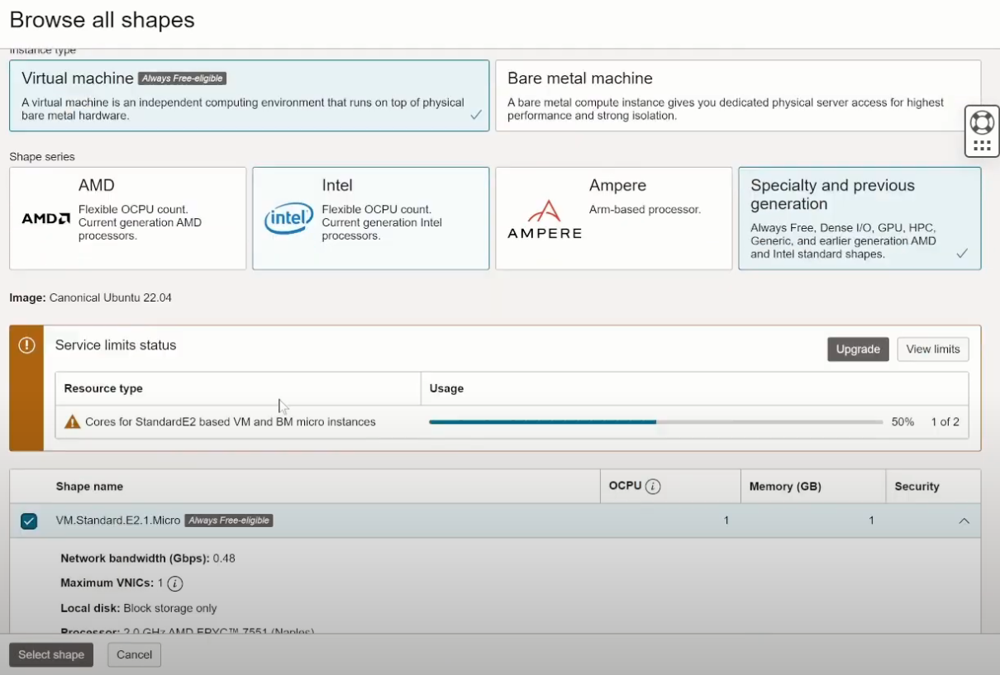
- Save the private SSH keys

#### Add panel and server to website records

Head to the website where you bought your domain.

- Go to the settings for DNS
- Add two new A Records
  - One with the IP of your Minecraft server
  - The other with the IP of the Pterodactyl panel
- Make sure both have a different host name, for instance `minecraft` and `panel`. We will be using this to be able to connect with the Pterodactyl panel.

This is an example of someone that uses the host name `connect` for their Minecraft server and `control` for their Pterodactyl panel.
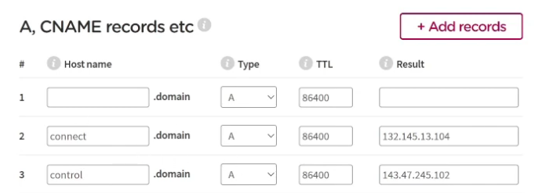

#### Setting up the panel VM

- Start by opening PuTTY or your terminal and SSH into the newly created VM
- Follow the same instructions are described in [updating the software](#Updating-the-software)
- Update the firewall settings, this should be done for both the panel and server VM, copy the commands below and paste them in the terminals

```bash
apt install firewalld
firewall-cmd --permanent --zone=public --add-port=25565/tcp
firewall-cmd --permanent --zone=public --add-port=80/tcp
firewall-cmd --permanent --zone=public --add-port=443/tcp
firewall-cmd --permanent --zone=public --add-port=2022/tcp
firewall-cmd --permanent --zone=public --add-port=22/tcp
firewall-cmd --permanent --zone=public --add-port=5657/tcp
firewall-cmd --permanent --zone=public --add-port=56423/tcp
firewall-cmd --permanent --zone=public --add-port=8080/tcp
firewall-cmd --reload
```

### Setting up pterodactyl

Paste the following command in the terminal of the panel VM

```bash
bash <(curl -s https://raw.githubusercontent.com/pterodactyl-installer/pterodactyl-installer/master/install.sh)
```

This will do a Q&A session with you where you need to fill in the following answers.

- What would you like to do?
  - `[0] Install the panel`
- Database name (panel)
  - _press enter_ (use default)
- Database username (pterodactyl)
  - _press enter_
- Password (press enter to use randomly generated password)
  - Just use a password that you can easily remember
- Select timezone
  - You can find your timezone on [this website](https://www.php.net/manual/en/timezones.php)
- Provide the email address that will be used to configure Let's Encrypt and Pterodactyl
  - Fill in your email
- Email address for the initial admin account
  - Use the same email (can be differrent)
- Username
  - `admin`
- Fill in your first and last name
- Set the FQDN of this panel (panel.example.com)
  - Use the following syntax: `{panel host name}.{domain}.{suffix}`
  - For instance `panel.akkerman.ai` is what I use
- Do you want to automatically configure UFW?
  - `N`
- Do you want to automatically configure HTTPS using Let's Encrypt?
  - `y`
- I agree that this HTTPS request is performed
  - `y`
  - If all went well you should see a summary of the information you filled in. If this is not the case then check if you wrote the step for the FQDN correct and cancel it.
- Initial configuration completed. Continue with installation?
  - `y`
- Agree to everything else that is shown after this (terms and services, etc.)

### Setting up wings

Paste the following command in the terminal of the Minecraft VM (this is the same command as we used for the panel)

```bash
bash <(curl -s https://raw.githubusercontent.com/pterodactyl-installer/pterodactyl-installer/master/install.sh)
```

- What would you like to do?
  - `[1] Install Wings`
- Do you want to automatically configure UFW?
  - `N`
- Do you want to automatically configure a user for database hosts?
  - `y`
- Do you want to configure MySQL to be accessed externally?
  - `y`
- Enter the panel address (blank for any address)
  - Use the following syntax: `{panel host name}.{your domain}.{suffix}`
  - For instance `panel.akkerman.ai` is what I use
- Database host username (pterodactyluser)
  - _press enter_
- Database host password
  - The password you filled in in the previous section
  - _If you get a warning about Let's Encrypt you can ignore this_
- Do you want to automatically configure HTTPS using Let's Encrypt?
  - `y`
- Set the FQDN to use for Let's Encrypt (node.example.com)
  - Use the following syntax: `{minecraft server host name}.{domain}.{suffix}`
- I agree that this HTTPS request is performed
  - `y`
- Enter email address for Let's Encrypt
  - This is the same email address you filled in before
- Proceed with installation?
  - `y`
- Agree to everything else that is shown after this

### Setting up the node

Now you can access your Pterodactyl website. Head to `{panel host name}.{domain}.{suffix}` and sign in.
Before creating the node we need to create a location.

- Click on the settings icon on the top right.
- Click on Locations
- Create new
- Fill in the Short Code, for instance `node` and save it

Now that we got the location we can create a new node.

- Head to Nodes and create a new node
- Add a name, for instance `Main`
- FQDN: `{minecraft server host name}.{domain}.{suffix}`
- Total memory: 24000
- Memory Over-Allocation: 0
- Total disk space: 45000
- Disk over-allocation: 0
- Leave the rest on their defaults
  - Unless you are using a proxy like Cloudfare, then set `Behind Proxy`
- Click `Create Node`

#### Create node allocation

- Open the newly created node
- Click on the tab `Allocation`
- Open your Minecraft VM terminal and paste this command

```bash
hostname -I | awk '{print $1}'
```

- Copy the result of that copy
- Paste that IP address in the IP Address field of `Assign New Allocations`
- Fill in `25565` for Ports
- Click on Submit

Use this image as an example.
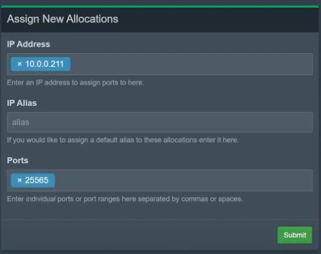

### Starting Wings

To start wings on the Minecraft VM we need a token.

- Go to the configuration tab of this node and click on `Generate Token`.
- Copy the whole command and paste it into the console of the Minecraft server. 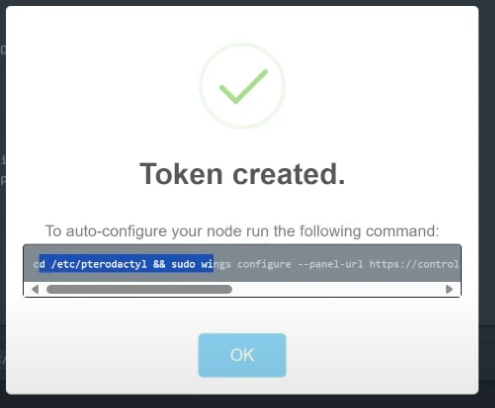
- To test if wings is installed correctly you can run:

```bash
sudo wings
```

- If is correct you will see a green heart on the left of your node.
  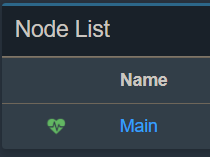
- Press `CTRL+C` in the console to exit wings
- Use to following command so that Wings will run in the background

```bash
systemctl start wings
```

### Creating a nest

- Head to the Nests option in the side bar
- Click on `Minecraft`
- Select `Forge Minecraft` in the options for Nest Eggs
- In Configuration you will find multiple lines in Docker Images, delete everything there
- Go to [pterodactyl-images](https://github.com/Software-Noob/pterodactyl-images#java-eclipse-temurin-amd64arm64) and head to the section `Java Eclipse Temurin [AMD64/ARM64]`
- Copy the correct java version for your Minecraft version. You can find the java version for each Minecraft version [here](https://docs.mcserversoft.com/advanced/java-version)
  - If you're using Minecraft version 1.20.1 this will be `ghcr.io/software-noob/pterodactyl-images:java_17`
- Leave everything else to their defaults and hit save

### Setting up the server

- Head to Servers in the left side bar
- Click on `Create New`
- Fill in the name of your server
- Add yourself as the server owner, you can search by name and email address
- Under Resource Management you can find Memory, I have set memory to `22000` but you can go for a lower number if you are using a vanilla server
- Disk space: `43000`
- Egg: `Forge Minecraft`
- Get the correct Forge version for your modpack and paste this in `Forge Version` under Service Variables. You can find this in the Curseforge app by clicking on the modpack you want to have as a server.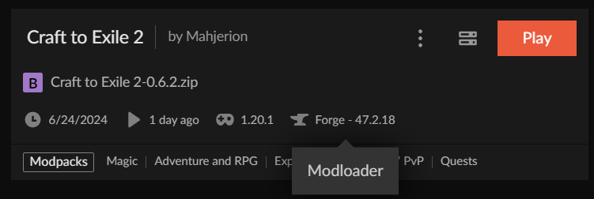
  - So in my case I fill in `1.20.1-47.2.18`
- Save
  If you click on the pop up button after creation you can see the terminal and the server should be starting now.

#### Debugging

During the starting of your server you can run into this error.

```
Error Event [a42aeaba-5a57-4b31-b888-f76257c1ab0f]: environment/docker: failed to start container: Error response from daemon: driver failed programming external connectivity on endpoint 1ba18bdc-05e9-4b6a-be5e-9a2df92f965e (7ed1002d6be9d188a6400cf5b06d94ac04cd0940a9c3e60b991f639eb0e0c6f0): failed to bind port 10.0.0.236:25565/tcp: Error starting userland proxy: listen tcp4 10.0.0.236:25565: bind: address already in use
```

This means that a Minecraft server is currently running on your Minecraft VM, be sure to stop it.

## Installing the Curseforge server

- Head to the [Files section](https://www.curseforge.com/minecraft/modpacks/craft-to-exile-2/files/all) of your preferred modpack
- Click on the latest release and at the bottom next to Changelog you will find `Additional Files` click on it.
- Download the server pack
- Extract the server pack and run the `.bat` or `.sh` file, depending on your OS. This will start the server locally and create some necessary files.
- Wait for it to stop due to the eula.txt and exit
  - Craft to Exile 2 automatically sets the eula.txt to True so you can exit once the server is completely done loading
- Delete the server .zip and zip the other files
- Go to the Pterodactyl panel and create a new server
- Wait for it to install everything.
- Wait for the EULA popup and then close it. You will see that the console will output a message like this and then will stop: `[main/INFO] [minecraft/Main]: You need to agree to the EULA in order to run the server. Go to eula.txt for more info.`
- Go to the `Files` tab and delete the following files from the container 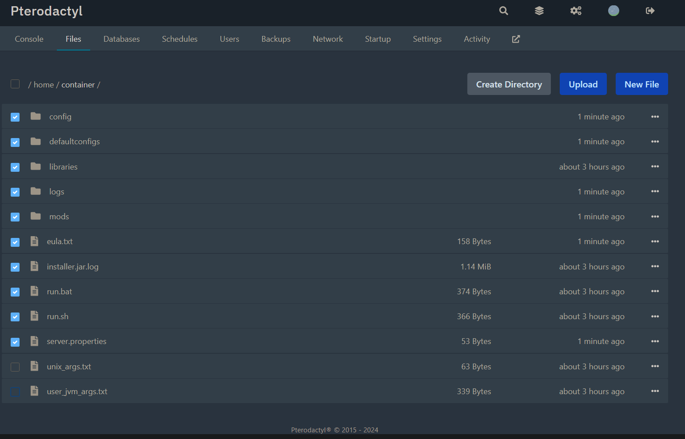
- Head to the Settings tab and SFTP into the server. 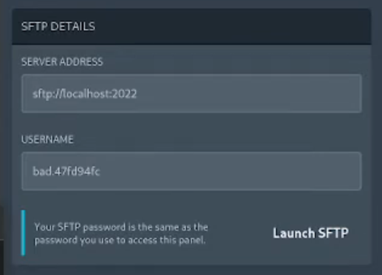
  - In this case the address is `sftp://bad.47fd94fc@localhost:2022` and the password is the same as to accessing the panel. You can also press the `Launch SFTP` button and it will open WinSCP or any other client that you have installed.
  - Your SFTP password is the same as the password you use to access this panel.
- After loading you will see the files that are still left in the container. Add the zip file we made earlier to it.
  - You can also delete the files from the previous step here.
- After the uploading is done, go back to the file overview in the panel. Press the 3 dots behind the zip file and select `Unarchive`. This will unpack the zip file.
- After unpacking, delete the .zip file to save space.
- Open the user_jvm_args.txt file
  - Delete the command `-XX:+AlwaysPreTouch`
  - Copy everything else after `-Xms8G -Xmx8G`
  - Head to your servers and open the settings for the server you are making.
  - Click on the `Startup` tab and paste the copied content in `Startup Command` after `-XX:MaxRAMPercentage=95.0`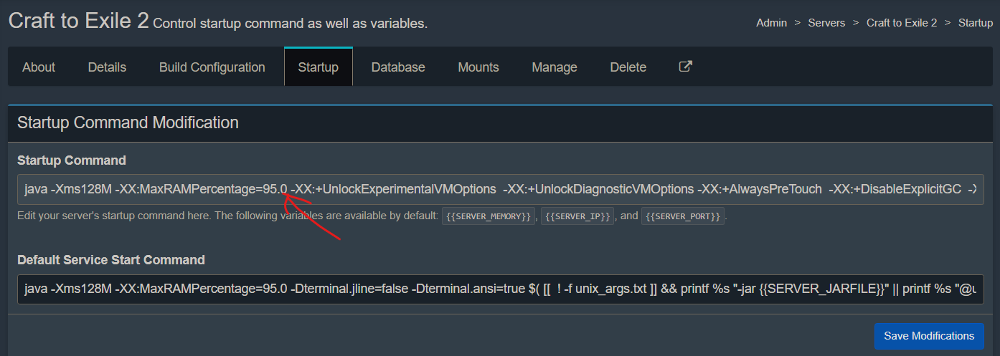
  - Click on `Save modifications`
- Start the server and accept the EULA
- Everything should start and you can now access the server

### Automatically restart every 6 hours

This is advised by the wiki of Craft to Exile 2.

- To set this up head to Schedules of your server and click on `Create schedule`.
- Give it a new, for instance `6 hourly restart`
- Use the following cron settings, or use this [tool](https://crontab.guru/) if you need a different timeframe
  - Minutes: `0`
  - Hour: `*/6`
  - Day (Month): `*`
  - Month: `*`
  - Day (Week): `*`
- Click on `New Task` for the created schedule
  - Action: `Send command`
  - Payload: `/say The server will be restarted in 1 minute`
  - Enable: `Continue on failure`
- Create a task for terminating the server
  - Action: `Send power action`
  - Payload: `Terminate the server`
  - Time offset: `60`
  - Enable `Continue on failure`
- Create another task, for starting the server
  - Action: `Send power action`
  - Payload: `Start the server`
  - Time offset: `70`
- To test that everything has been set correctly, click the `Run Now` button on the Schedules overview.
- Head back to the server's console and wait for it to perform all actions.

## Acknowledgements

- I used multiple YouTube videos of [HP_crafter](https://www.youtube.com/@hp_crafter4609) for this guide.
- For the section [Installing the Curseforge server](#Installing-the-Curseforge-server) I used this [video](https://www.youtube.com/watch?v=G_lAAzOO9c0)
- I used this [video] as a guide for the section [Automatically restart every 6 hours](#Automatically-restart-every-6-hours)
